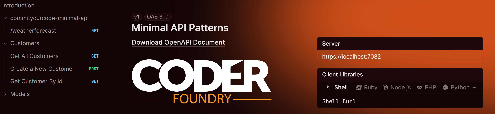

# Minimal APIs at Scale  
**Enterprise-Ready Minimal APIs in .NET: Scaling Simplicity**  
_A demo repo for Bobby's talk at CommitYourCode 2025_  

---

## Overview
This repository contains the **finished demo code** from my presentation **Minimal APIs at Scale**.

In the talk, I live-coded parts of the `CustomerEndpoints` to show how Minimal APIs evolve from a toy Weather example in `Program.cs` into a **structured, enterprise-ready API**.  
This repo includes the **complete, working version** of that code.

You’ll see:
- How to structure Minimal APIs with **extension methods**
- Using **DTOs** (`CustomerRequest`, `CustomerResponse`) to separate contracts from entities
- Built-in validation in .NET 10
- Consistent error handling with **endpoint filters**
- Returning strong responses with `TypedResults` and `CreatedAtRoute`
- Configuring **OpenAPI + Scalar** via extension methods

---

## Project Structure

````text
.
├── Endpoints/
│   └── Customer/
│       └── CustomerEndpoints.cs
├── Extensions/
│   └── OpenApiExtensions.cs
├── Filters/
│   └── ExceptionHandlingFilter.cs
├── Models/
│   ├── Customer.cs
│   └── DTO/
│       ├── CustomerRequest.cs
│       └── CustomerResponse.cs
├── Services/
│   ├── ICustomerService.cs
│   └── CustomerService.cs
├── Program.cs
└── <project>.csproj
````

 - **Endpoints/Customer/** – Customer-specific endpoints via extension methods (app.MapCustomerEndpoints()).

 - **Extensions/**         – Application configuration helpers (e.g., ConfigureOpenApi, MapScalar).

 - **Filters/**            – Cross-cutting concerns (e.g., exception handling).

 - **Models/**             – Entities and DTOs (request/response contracts).

 - **Services/**           - Business logic implementation for ICustomerService.
 
 - **Program.cs**          – Application entry point (minimal setup, delegates to extensions)

---

## 🚀 Running the App
### ✅ Prerequisites

 - [Visual Studio 2026](https://visualstudio.microsoft.com/insiders/)
 or the .NET CLI

 - [.NET 10 SDK RC1](https://dotnet.microsoft.com/en-us/download/dotnet/10.0) installed.

Check your installed SDKs with:

```
dotnet --list-sdks

```

You should see something like:

```
10.0.xxx [C:\Program Files\dotnet\sdk]

```

### Clone the Repo

```
git clone https://github.com/CoderFoundry/commityourcode-minimal-api.git
cd commityourcode-minimal-api

```
### Run the App
1. Open the solution in Visual Studio 2026 
2. Press F5 or (ctril+F5) to run.

You can also use Visual Studio Code to open the project and use the .NET CLI

To run the app using the CLI
```
dotnet run

```
---

### 🌐 Explore the API

Once running, open **Scalar** (API reference UI):  
[http://localhost:7022/](http://localhost:7022)

- If you’re running from **Visual Studio 2026**, it should launch automatically in your browser.  
- If not, you may need to adjust your **launchSettings.json** file under `Properties/` to include the Scalar URL.  
- If you’re running from the **CLI**, open the URL manually (port may vary based on your local environment).

When the app is running, you should see a **Customers dropdown** with the three endpoints:

- `GET /customers`  
- `GET /customers/{id}`  
- `POST /customers`  



## Endpoints

- GET /customers → Returns all customers

- GET /customers/{id} → Returns a customer by ID

- POST /customers → Creates a new customer (with validation)

Each endpoint delegates business logic to `ICustomerService`, keeping handlers lean and maintainable.  
You can see the full implementation in:  
[`Services/CustomerService.cs`](Services/CustomerService.cs)

---

## About the Demo

During my talk, I showed:

1. Weather endpoint in Program.cs (simple example from Microsoft).

2. Moving Customers into CustomerEndpoints.cs via extension methods.

3. Adding app.MapCustomerEndpoints(); to keep Program.cs clean.

4. Live-coding the POST /customers endpoint.

***This repo contains the finished version so that you can run everything end-to-end without modification.***

### Learn More

Want to go deeper into .NET, Blazor, and API patterns?
👉 [learn.coderfoundry.com](https://learn.coderfoundry.com)

### License

MIT License – free to use, share, and adapt.
